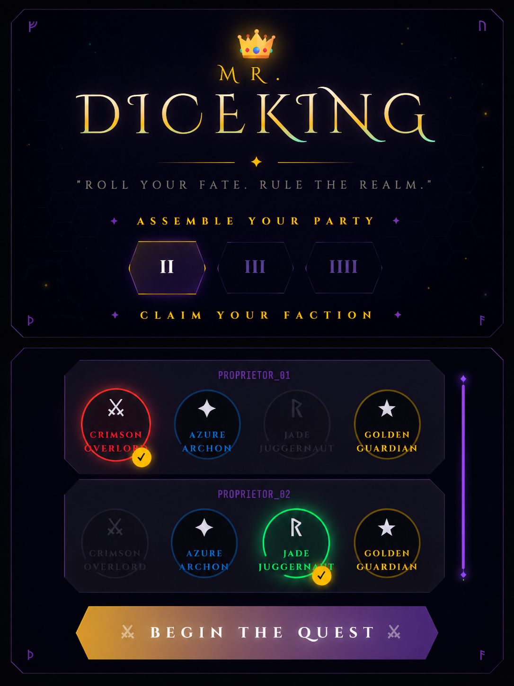
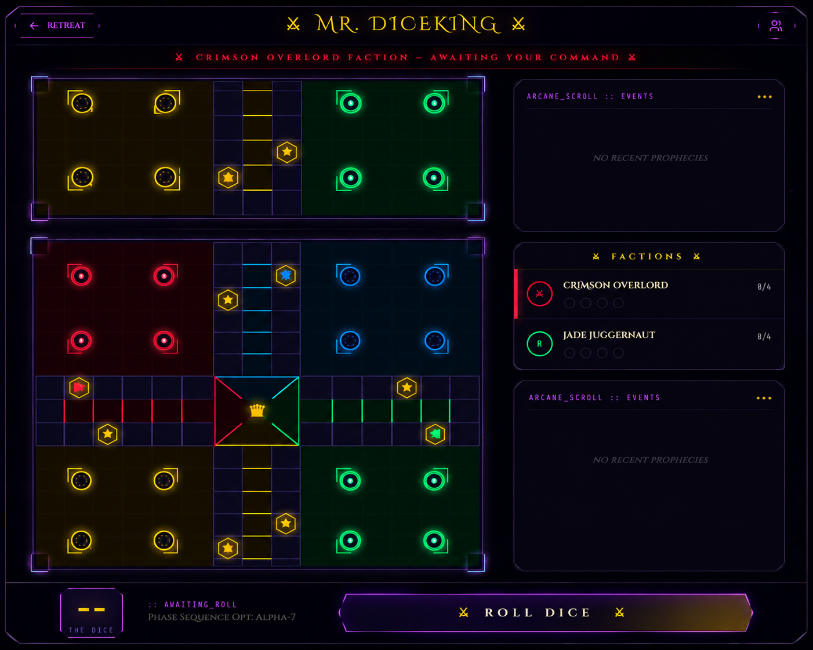

# 🎮 Mr. DiceKing

> ⚔️ *Roll Your Fate. Rule The Realm.* ⚔️

Mr. DiceKing is a stylish offline Ludo-inspired strategy game featuring a unique fusion of 🌌 Neon Cyberpunk visuals and 🛡️ Fantasy/RPG-themed UI design. Built using Kotlin, Jetpack Compose, and Canvas rendering, the project reimagines the classic board game experience with immersive faction-based gameplay aesthetics, glowing interfaces, and smooth turn-based interactions.

The game focuses on delivering a visually engaging local multiplayer experience while maintaining the core mechanics of traditional Ludo gameplay, including safe zones, token movement, captures, and home path progression.

---

## ✨ Features

- 🎲 Classic offline Ludo gameplay
- 👥 Local multiplayer support
- 🌌 Neon Cyberpunk inspired interface
- ⚔️ Fantasy/RPG faction-themed design
- ⭐ Safe zone & capture mechanics
- 🏁 Home path and win conditions
- 🎨 Custom Canvas-rendered board
- ⚡ Smooth UI interactions and transitions

---

## 🧠 Tech Stack

- 🟣 Kotlin
- 📱 Android Studio
- 🎨 Jetpack Compose
- 🖌️ Canvas Rendering
- 🧩 MVVM Architecture
- 🤖 AI-assisted Prompt Engineering Workflow

---

## 🌐 Live Demo

[🎮 Play Mr. DiceKing Online Demo](https://mr-diceking-892107897605.asia-southeast1.run.app/)

---

## 📸 Screenshots

### 🎮 Gameplay Screen



### ⚔️ Faction Selection Screen



---

## 🚀 Development Highlights

- Designed using iterative prompt engineering workflows
- Focused on:
  - Board symmetry
  - Path-based movement logic
  - Safe-zone positioning
  - UI alignment & rendering
  - Neon-themed visual consistency

---

## 📎 Run Locally

```bash
git clone https://github.com/Divyeshb3/Mr.DiceKing.git
```

---

## ⭐ Support

If you like this project, consider giving it a ⭐ on GitHub!
